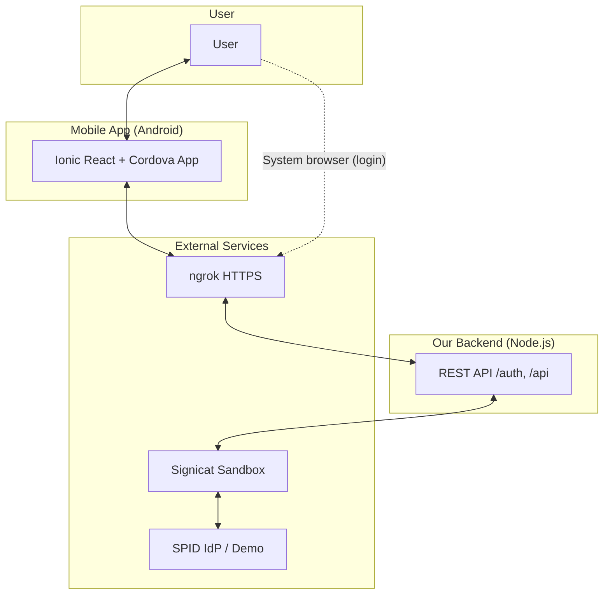
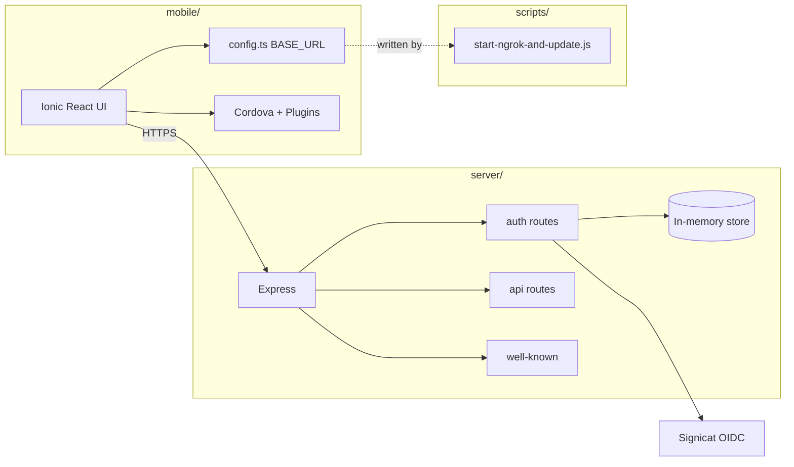
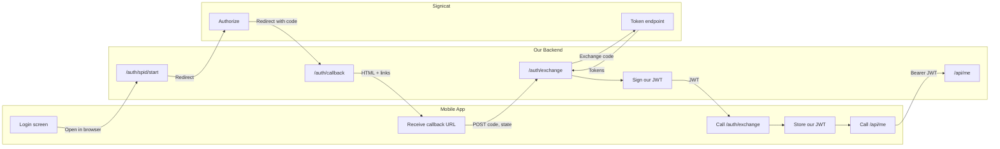
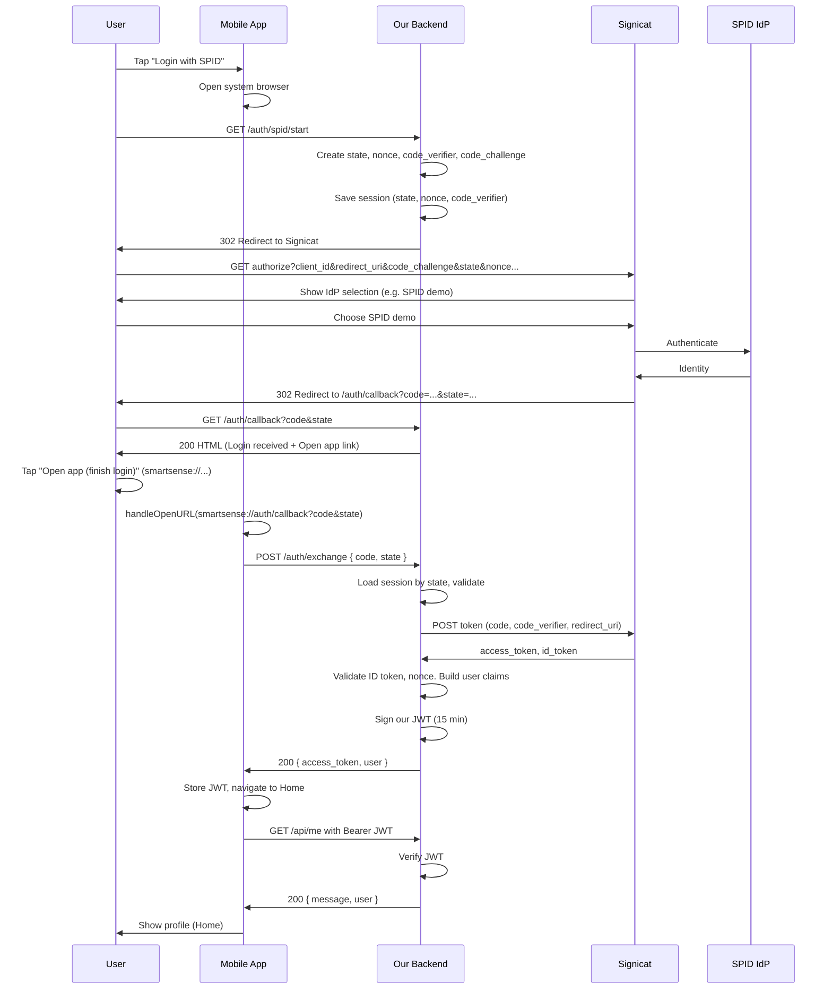
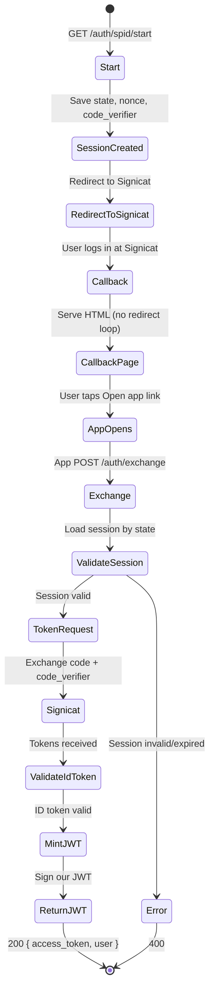
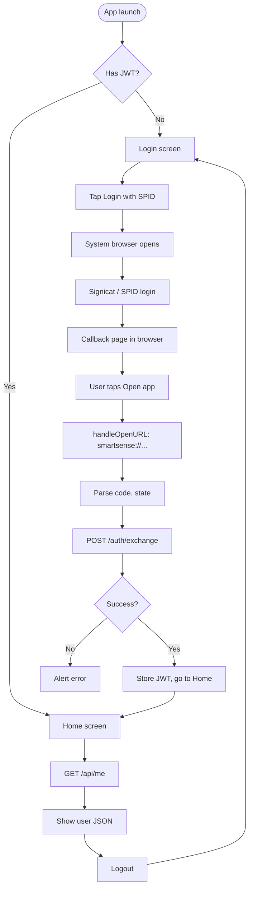
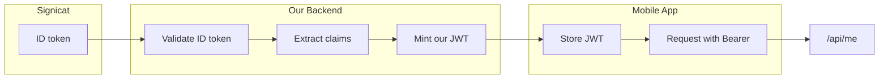
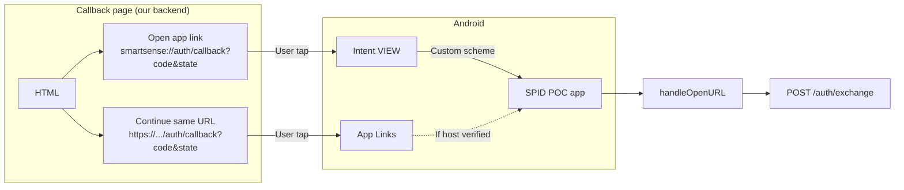

# SPID SSO POC — Project Documentation

**Document version:** 1.0  
**Last updated:** February 2025  
**Purpose:** Stakeholder-ready technical and architectural documentation of the SPID (Sistema Pubblico di Identità Digitale) Single Sign-On proof-of-concept.

---

## Table of contents

1. [Executive summary](#1-executive-summary)
2. [What we have achieved](#2-what-we-have-achieved)
3. [High-level architecture](#3-high-level-architecture)
4. [Approach and design decisions](#4-approach-and-design-decisions)
5. [Authentication and data flows](#5-authentication-and-data-flows)
6. [Implementation overview](#6-implementation-overview)
7. [Security considerations](#7-security-considerations)
8. [Deployment and operations](#8-deployment-and-operations)
9. [References and glossary](#9-references-and-glossary)

---

## 1. Executive summary

This project delivers a **production-style proof-of-concept** for **SPID (Italian national digital identity)** login in a mobile application. Users sign in with their SPID identity via the **Signicat** aggregation platform; our backend performs the OIDC (OpenID Connect) flow with Signicat, then issues **our own JWT** to the mobile app. The app never sees Signicat tokens—only our API and our token—so the design is **production-aligned** and easy to extend (e.g. add more identity providers or move to a fixed domain).

| Dimension | Choice |
|-----------|--------|
| **Identity aggregator** | Signicat Sandbox (real SPID test environment) |
| **Mobile stack** | Ionic React (TypeScript) + Cordova (Android) |
| **Backend** | Node.js (TypeScript) + Express |
| **Auth standard** | OIDC Authorization Code + PKCE |
| **Local HTTPS** | ngrok (free tier) for callback URL; script keeps config in sync |

The end-to-end flow has been validated: **Login with SPID** in the app → system browser → Signicat → SPID demo → callback page → **Open app** (custom scheme) → app receives code/state → backend exchanges for tokens and mints our JWT → app calls protected `/api/me` and displays user profile.

---

## 2. What we have achieved

- **End-to-end SPID login** in an Android app (emulator and device) using Signicat Sandbox and SPID test/demo identity.
- **Backend-driven OIDC**: Backend owns the relationship with Signicat (client_id, client_secret, redirect_uri); mobile app only opens a URL and later sends the callback `code` and `state` to our API.
- **Our own JWT**: Backend exchanges the authorization code with Signicat, validates the ID token, then issues a **short-lived JWT** (15 min) for our APIs. The app uses this JWT for `GET /api/me` and future protected endpoints.
- **Dual callback strategy**: Callback URL is always **HTTPS** (Signicat requirement). We serve an HTML page that offers:
  - **“Open app (finish login)”** using custom scheme `smartsense://auth/callback?code=...&state=...` so the app opens even when the public URL host changes (e.g. ngrok free).
  - Optional **“Continue (same URL)”** for Android App Links when the host is stable.
- **PKCE**: Full PKCE (code_challenge / code_verifier) implemented so Signicat’s “code challenge required” is satisfied.
- **SPID metadata**: Documented and validated flow with Signicat SPID metadata registration so the SPID validator (AgID) accepts the request.
- **Operational scripts**: ngrok URL is read from the ngrok API and written into `server/.env`, `mobile/src/config.ts`, and (optionally) `mobile/config.xml` for App Links host, so the team can run with a changing ngrok URL without manual edits.
- **Stable mobile UX**: Routing fixed so the app shows the Login screen on both browser (`/`) and Cordova (`/index.html`), and the callback page no longer auto-refreshes (eliminating the previous redirect loop).

---

## 3. High-level architecture

### 3.1 System context

- **User** interacts with the **mobile app** and, during login, with the **system browser**.
- **Mobile app** talks to our backend only via **HTTPS** (in the POC, through **ngrok**).
- **Our backend** implements auth endpoints and calls **Signicat** (OIDC).
- **Signicat** aggregates **SPID** (and other IdPs); for the POC we use the SPID demo identity.

### 3.2 Component architecture

- **mobile/**: Ionic React app; `config.ts` holds `BASE_URL` (kept in sync by scripts). Cordova provides the Android build and plugins (InAppBrowser, custom URL scheme).
- **server/**: Express app with auth routes (start, callback, exchange), API routes (e.g. `/api/me`), and `/.well-known/assetlinks.json`. Auth uses an in-memory session store (state, nonce, code_verifier).
- **scripts/**: `start-ngrok-and-update.js` reads the ngrok API and updates backend and mobile config (and optionally App Links host).

### 3.3 Authentication architecture (OIDC + our JWT)

- The app only initiates login (open URL) and then sends **code + state** to our backend.
- The backend performs the full OIDC flow with Signicat (authorize + token exchange), then **mints and returns our JWT**.
- All subsequent API access uses **our JWT**, not Signicat’s access token.

---

## 4. Approach and design decisions

| Decision | What we did | Why |
|----------|-------------|-----|
| **Backend holds OIDC client** | Server uses Signicat client_id, client_secret, redirect_uri; discovers Signicat via OIDC discovery. | Keeps secrets and redirect URI on the server; mobile only needs to open a URL and later send code/state. |
| **Our own JWT for the app** | After code exchange, backend validates Signicat’s ID token, then issues a JWT signed with `APP_JWT_SECRET`. | App and other services depend only on our token format and lifetime; we can add claims and revoke without touching Signicat. |
| **System browser for login** | App opens `BASE_URL/auth/spid/start` in the **system** browser (`_system`). | Cookies and redirects behave like a normal browser; Signicat and SPID pages render correctly. |
| **Callback URL always HTTPS** | Signicat redirect_uri is `https://<domain>/auth/callback`. | Signicat (and SPID) require HTTPS; we use ngrok in POC and a fixed domain in production. |
| **Dual callback (HTTPS + custom scheme)** | Callback page offers a link with `smartsense://auth/callback?code=...&state=...`. | With ngrok free, the host changes; custom scheme reliably opens the app. With a fixed domain, App Links can be used as well. |
| **PKCE** | Backend generates code_verifier and code_challenge (S256); sends challenge at authorize, verifier at token exchange. | Signicat requires PKCE for the authorization code flow; it also improves security for public clients. |
| **State and nonce** | Backend stores state, nonce, and code_verifier per auth request; validates on callback and exchange; one-time use. | Mitigates CSRF and replay; ensures the code is used with the same session that started the flow. |
| **No auto-refresh on callback page** | Callback HTML has no meta refresh and no JS redirect to the same URL. | Prevents an infinite GET loop on the callback URL; user explicitly taps “Open app” or “Continue”. |
| **ngrok + script** | Script reads ngrok tunnels API and updates `BASE_URL` in server and mobile. | Keeps backend and app in sync when the ngrok URL changes; one command after starting ngrok. |
| **Environment-driven port** | Server port comes from `PORT` in `.env`. | Allows changing the port without code changes; script and docs can reference the same port. |

---

## 5. Authentication and data flows

### 5.1 End-to-end login sequence

### 5.2 Backend auth state flow

### 5.3 Mobile app screen flow

### 5.4 Token and claims data flow

- **Signicat** returns an **ID token** (and access token) after code exchange. We use the ID token for **claims** (sub, name, email, etc.).
- **Backend** validates the ID token and nonce, extracts claims, then **mints our JWT** containing the same (or a subset of) claims and signs it with `APP_JWT_SECRET`.
- **Mobile app** stores our JWT and sends it as `Authorization: Bearer <token>` on every call to our API (e.g. `/api/me`).

### 5.5 Callback URL and app opening

- **Primary path**: User taps **“Open app (finish login)”** → `smartsense://auth/callback?code=...&state=...` → Android opens our app → Cordova plugin sets `handleOpenURL` → app parses and calls `/auth/exchange`.
- **Secondary path**: User taps **“Continue (same URL)”** → HTTPS link → Android may open the app via App Links if the host is verified (e.g. `assetlinks.json` and stable domain).

---

## 6. Implementation overview

### 6.1 Backend (server/)

| Area | Implementation | File(s) |
|------|----------------|--------|
| **Config** | Env vars via `dotenv`; validation with Zod; `BASE_URL` optional until ngrok script runs. | `src/config.ts` |
| **Auth start** | OIDC discovery with `openid-client`; generate state, nonce, code_verifier, code_challenge; store in session; redirect to Signicat authorize URL. | `src/routes/auth.ts` (GET /auth/spid/start) |
| **Callback** | Return HTML with “Login received” and two links (smartsense:// and HTTPS); no meta refresh or JS redirect. | `src/routes/auth.ts` (GET /auth/callback) |
| **Exchange** | Validate state (one-time, TTL); exchange code with Signicat (with code_verifier); validate ID token and nonce; mint our JWT (15 min); return access_token and user. | `src/routes/auth.ts` (POST /auth/exchange) |
| **Protected API** | JWT middleware; decode and attach user; return profile. | `src/routes/api.ts` (GET /api/me) |
| **Asset links** | Serve `/.well-known/assetlinks.json` with package name and SHA256 fingerprint from env. | `src/routes/wellKnown.ts` |
| **Session store** | In-memory Map keyed by state; fields: state, nonce, codeVerifier, correlationId, createdAt; one-time use and 5‑min TTL. | `src/store.ts` |

### 6.2 Mobile (mobile/)

| Area | Implementation | File(s) |
|------|----------------|--------|
| **Base URL** | Single source: `src/config.ts` (`BASE_URL`); updated by ngrok script. | `src/config.ts` |
| **Login** | Button opens `BASE_URL/auth/spid/start` in system browser via Cordova InAppBrowser. | `src/pages/LoginPage.tsx` |
| **Deep link** | `window.handleOpenURL` set in App; Cordova plugin invokes it for `smartsense://auth/callback?...`; parse code/state and call `exchangeAndNavigate`. | `src/App.tsx` |
| **Exchange** | POST `BASE_URL/auth/exchange` with `{ code, state }`; store `access_token` in localStorage; navigate to Home. | `src/App.tsx` (exchangeAndNavigate) |
| **Home** | GET `BASE_URL/api/me` with `Authorization: Bearer <token>`; show JSON; Logout clears token and goes to Login. | `src/pages/HomePage.tsx` |
| **Routing** | Routes for `/login`, `/home`, `/`, `/index.html`; root and `/index.html` redirect to /login or /home by token. | `src/App.tsx` |
| **Build** | Vite with `base: './'` so assets load in Cordova WebView; output to `www/`. | `vite.config.ts` |
| **Cordova** | Android platform; plugins: InAppBrowser, custom URL scheme (smartsense); intent-filters for smartsense and HTTPS (App Links). | `config.xml`, `platforms/android` |

### 6.3 Scripts (scripts/)

| Script | Purpose |
|--------|--------|
| **start-ngrok-and-update.js** | Read `http://127.0.0.1:4040/api/tunnels`; get HTTPS URL; write `BASE_URL` to `server/.env` and `mobile/src/config.ts`; optionally update `mobile/config.xml` host for App Links; print Signicat redirect URI and health URL. |
| **update-env-files.js** | Same updates using `BASE_URL` from environment (no ngrok API). |

---

## 7. Security considerations

- **Secrets**: Signicat client_secret and `APP_JWT_SECRET` live only in `server/.env` (gitignored). Mobile has no Signicat secrets.
- **PKCE**: Reduces risk of authorization code interception; required by Signicat.
- **State and nonce**: Limit CSRF and ID token replay; session is one-time use and short-lived (5 min).
- **Our JWT**: Short expiry (15 min); signed with a dedicated secret; can be extended with refresh tokens or revocation later.
- **HTTPS**: All backend and Signicat traffic over HTTPS; in POC via ngrok, in production via proper TLS.
- **CORS**: Backend allows requests from any origin (POC); for production, restrict to the app’s origin/scheme.
- **Asset links**: Served dynamically with the configured fingerprint so App Links verification matches the build.

---

## 8. Deployment and operations

- **Run backend**: `cd server && npm run dev` (or `npm run server` from root).
- **Run ngrok**: `ngrok http <PORT>` (PORT from `server/.env`).
- **Update config**: `node scripts/start-ngrok-and-update.js`; then set Signicat redirect URI to the printed `https://<host>/auth/callback`.
- **Build and run app**: `cd mobile && npm run build && npx cordova prepare android && npx cordova run android`.
- **Production**: Use a fixed domain; set `BASE_URL` and Signicat redirect URI to that domain; no need for custom scheme if App Links are verified.

Detailed setup (tools, Android, Signicat, troubleshooting) is in [README.md](README.md).

---

## 9. References and glossary

| Term | Meaning |
|------|--------|
| **SPID** | Sistema Pubblico di Identità Digitale — Italian national digital identity system. |
| **Signicat** | Identity aggregation platform; in this POC we use Signicat Sandbox as the OIDC/OAuth2 client facing SPID. |
| **OIDC** | OpenID Connect — identity layer on top of OAuth 2.0; we use Authorization Code flow with PKCE. |
| **PKCE** | Proof Key for Code Exchange — code_challenge (at authorize) and code_verifier (at token exchange). |
| **Redirect URI** | URL where the IdP redirects after login; must match exactly in Signicat (e.g. `https://<domain>/auth/callback`). |
| **App Links** | Android mechanism to open an app when the user taps an HTTPS link that matches the app’s verified domain. |
| **Custom URL scheme** | `smartsense://auth/callback` — alternative way to open the app from the callback page when the host is not stable (e.g. ngrok). |

---

*This document describes the SPID SSO POC as implemented and validated for stakeholder review.*
